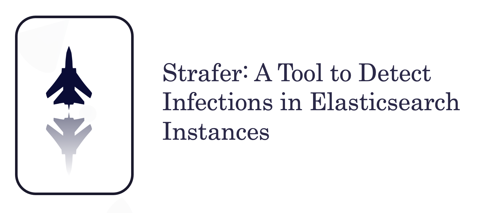

# Strafer

Elasticsearch infections are rising exponentially. The adversaries are exploiting open and exposed Elasticsearch interfaces to trigger infections in the cloud and non-cloud deployments. During this talk, we will release a tool named "STRAFER" to detect potential infections in the Elasticsearch instances. The tool allows security researchers, penetration testers, and threat intelligence experts to detect compromised and infected Elasticsearch instances running malicious code. The tool also enables you to conduct efficient research in the field of malware targeting cloud databases. In this version of the tool, the following modules are supported:

* Elasticsearch instance information gathering and reconnaissance
* Elasticsearch instance exposure on the Internet
* Detecting potential ransomware infections in the Elasticsearch instances
* Detecting potential botnet infections such as meow botnet.
* Detecting infected indices in the Elasticsearch instances
* Detecting Elasticsearch honeypots

Note: This is the first release of the tool and we expect to add more modules in the nearby future.
